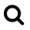
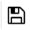
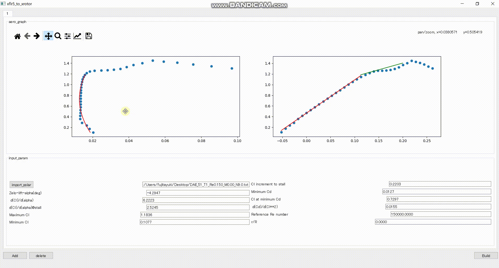
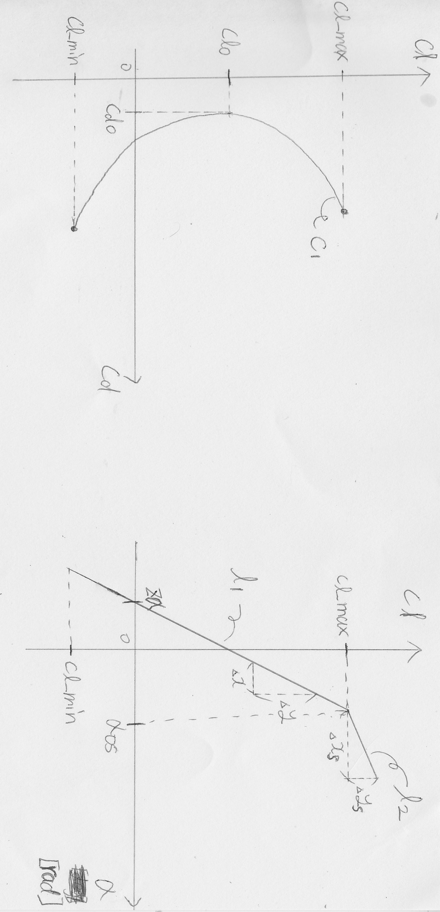
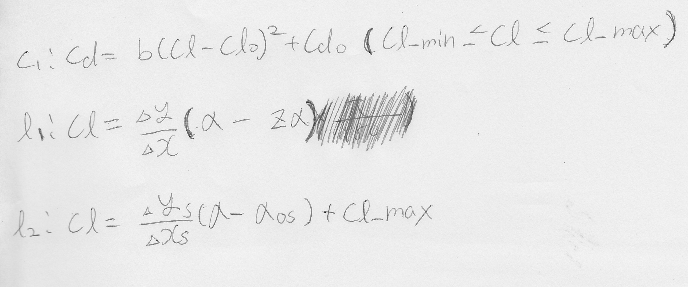

# 概要
distフォルダにexe有

翼型解析ソフト[xflr5](http://www.xflr5.tech/xflr5.htm)の解析結果(polarファイル)からCl_alpha,Cl_Cdグラフの近似モデルを作成し、プロペラ設計ソフト[xrotor](http://web.mit.edu/drela/Public/web/xrotor/)のaeroファイルを出力するプログラム

自動で近似モデルを作成するが、各自が解析結果と見比べながら、パラメータを調整し、好みの近似モデルに変更することもできる。

出力ファイルはxrotorの
```
>>aero
>>read
>>出力ファイルパス
```
より読み取り可能。

以下デモ


# 動作環境
exeファイルが開ける端末

もしくは、以下python環境
```
certifi==2020.6.20
cycler==0.10.0
kiwisolver==1.2.0
matplotlib==3.3.1
numpy==1.19.1
Pillow==7.2.0
pyparsing==2.4.7
PyQt5==5.15.0
PyQt5-sip==12.8.0
python-dateutil==2.8.1
six==1.15.0
```

# 準備(起動まで)
方法は以下2つ

## 方法1
このレポジトリをダウンロード及び解凍し、distフォルダ内のxflr5_to_xrotor.exeを開く。

## 方法2
### 手順1
[python](https://www.python.org/)をダウンロード

### 手順2
このレポジトリをダウンロード及び解凍。

### 手順3
自分のpthon環境との干渉を防ぐために、仮想環境の構築を推奨。

特に、anacondaを使用している場合、干渉可能性が大きいため、強く推奨。

構築方法は以下、(python3系)
```
py -m venv [解凍したレポジトリのパス]
cd [解凍したレポジトリのパス]
Scripts\activate
pip install -r requirements.txt
```

仮想環境を終了する場合は、
```
Scripts\deactivate
```

以降

```
Scripts\activate
```
で同環境構築可能

# 使い方
## 1. xflr5解析結果をファイルにエクスポート
設計に採用する翼型のdatファイルをxflr5で解析し、解析結果をファイルにエクスポートする。

以下デモ動画では、DAE-51をエクスポートしている。


エクスポートしたファイルの内容が以下のようになっていることを確認する。

```
xflr5 v6.46

 Calculated polar for: DAE-51

 1 1 Reynolds number fixed          Mach number fixed         

 xtrf =   1.000 (top)        1.000 (bottom)
 Mach =   0.000     Re =     0.150 e 6     Ncrit =   9.000

  alpha     CL        CD       CDp       Cm    Top Xtr Bot Xtr   Cpmin    Chinge    XCp    
 ------- -------- --------- --------- -------- ------- ------- -------- --------- ---------
  -3.000   0.1077   0.02033   0.01225  -0.1080  0.9143  0.0593  -1.8995   0.0000   1.2635
  -2.500   0.1760   0.01826   0.01007  -0.1099  0.9047  0.0708  -1.6621   0.0000   0.8794
  -2.000   0.2355   0.01677   0.00877  -0.1103  0.8924  0.1032  -1.4225   0.0000   0.7215
  -1.500   0.2858   0.01411   0.00822  -0.1093  0.8805  0.6174  -1.2025   0.0000   0.6344
  -1.000   0.3592   0.01312   0.00771  -0.1109  0.8699  1.0000  -0.8445   0.0000   0.5595
  -0.500   0.4159   0.01316   0.00739  -0.1105  0.8559  1.0000  -0.5931   0.0000   0.5159
   0.000   0.4699   0.01324   0.00720  -0.1097  0.8405  1.0000  -0.6334   0.0000   0.4828
   0.500   0.5238   0.01331   0.00706  -0.1087  0.8248  1.0000  -0.6772   0.0000   0.4565
   1.000   0.5776   0.01336   0.00694  -0.1077  0.8087  1.0000  -0.7245   0.0000   0.4348
   1.500   0.6315   0.01338   0.00683  -0.1066  0.7921  1.0000  -0.7771   0.0000   0.4167
   2.000   0.6858   0.01338   0.00673  -0.1056  0.7750  1.0000  -0.8366   0.0000   0.4014
   2.500   0.7379   0.01347   0.00678  -0.1043  0.7547  1.0000  -0.9021   0.0000   0.3883
   3.000   0.7922   0.01344   0.00669  -0.1032  0.7353  1.0000  -0.9784   0.0000   0.3768
   3.500   0.8448   0.01351   0.00676  -0.1020  0.7127  1.0000  -1.0655   0.0000   0.3668
   4.000   0.8976   0.01356   0.00681  -0.1008  0.6887  1.0000  -1.1767   0.0000   0.3578
   4.500   0.9501   0.01365   0.00690  -0.0995  0.6623  1.0000  -1.3442   0.0000   0.3497
   5.000   1.0011   0.01382   0.00712  -0.0980  0.6321  1.0000  -1.5853   0.0000   0.3423
   5.500   1.0508   0.01407   0.00740  -0.0963  0.5975  1.0000  -1.8737   0.0000   0.3355
   6.000   1.0985   0.01443   0.00778  -0.0943  0.5565  1.0000  -2.1994   0.0000   0.3291
   6.500   1.1429   0.01493   0.00826  -0.0919  0.5056  1.0000  -2.5537   0.0000   0.3230
   7.000   1.1836   0.01568   0.00893  -0.0890  0.4451  1.0000  -2.9188   0.0000   0.3172
   7.500   1.2189   0.01679   0.00988  -0.0856  0.3714  1.0000  -3.2748   0.0000   0.3115
   8.000   1.2463   0.01850   0.01124  -0.0813  0.2825  1.0000  -3.6136   0.0000   0.3058
   8.500   1.2624   0.02112   0.01328  -0.0760  0.1777  1.0000  -3.9069   0.0000   0.3001
   9.000   1.2638   0.02473   0.01625  -0.0689  0.1009  1.0000  -4.1165   0.0000   0.2938
   9.500   1.2680   0.02821   0.01957  -0.0627  0.0733  1.0000  -4.3362   0.0000   0.2880
  10.000   1.2784   0.03170   0.02302  -0.0578  0.0595  1.0000  -4.5869   0.0000   0.2831
  10.500   1.2969   0.03526   0.02657  -0.0541  0.0507  1.0000  -4.8700   0.0000   0.2788
  11.000   1.3273   0.03875   0.03015  -0.0514  0.0441  1.0000  -5.1965   0.0000   0.2751
  11.500   1.3685   0.04258   0.03414  -0.0498  0.0391  1.0000  -5.5921   0.0000   0.2720
  12.000   1.4039   0.04737   0.03936  -0.0479  0.0358  1.0000  -5.9242   0.0000   0.2690
  12.500   1.4488   0.05315   0.04536  -0.0475  0.0334  1.0000  -6.3432   0.0000   0.2669
  13.000   1.4305   0.05926   0.05228  -0.0419  0.0328  1.0000  -6.3694   0.0000   0.2626
  13.500   1.4093   0.06681   0.06050  -0.0382  0.0326  1.0000  -6.3641   0.0000   0.2596
  14.000   1.3778   0.07557   0.06987  -0.0363  0.0327  1.0000  -6.2973   0.0000   0.2580
  14.500   1.3417   0.08564   0.08045  -0.0369  0.0329  1.0000  -6.1928   0.0000   0.2583
  15.000   1.3059   0.09688   0.09211  -0.0401  0.0332  1.0000  -6.0692   0.0000   0.2606
  15.500   1.2758   0.10876   0.10431  -0.0452  0.0334  1.0000  -5.9520   0.0000   0.2644
```

## 2. エクスポートしたファイルをxflr5_to_xrotorで読み込む
xflr5_to_xrotorを起動し、先ほどエクスポートしたファイルを読み込む。

読み込んだ時点で、自動的に近似モデルが作成される。

青い点が読み込んだ解析結果、赤、緑の線が近似モデルとなっている。

以下デモ動画参照


## 3. 近似の修正
自動的に生成された近似のうち気に入らないところを修正する。

グラフを拡大して、赤、緑の線が青い点に近似できているかを確認し、不十分であれば、入力値を修正する。

以下、グラフ操作、入力値で詳細を説明する。

### 3-1. グラフ操作
左上の各種ツールアイコンでグラフの操作可能

以下左から順に説明
-  : グラフのリセット
-  : 1つ戻る
-  : 1つ進む
-  : グラフの移動
-  : グラフの拡大
-  : グラフの表示設定、プロットデータエクスポート
-  : プロット範囲、色、太さ等指定
-  : グラフ画像保存



### 3-2. 入力値
近似モデルを作るためのパラメータ。

Cl_Cdグラフを二次関数で、Cl_αグラフを2つの直線で近似する。

xrotorのaeroと入力内容はほとんど同じ。(http://web.mit.edu/drela/Public/web/xrotor/xrotor_doc.txt)

以下図参照

- Zelo-lift-alpha(deg) : zα×180/π(注意:xrotorの仕様でこれだけ単位がdeg)
- d(Cl)/d(alpha) : Δy/Δx
- d(Cl)/d(alpha)@stall : Δys/Δxs
- Maximum Cl : Cl_max
- Minimum Cl : Cl_min
- Cl increment to stall : Δys
- Minimum Cd : Cdo
- Cl at minimum Cd : Clo
- d(Cd)/d(Cl**2) : b
- Reference Re number : 解析したレイノルズ数
- r/R : 解析した翼型を使用する箇所

また、cl_max以上またはcl_min以下の領域は、xrotor上で失速と判定され、抗力係数は自動的に高い値が振られる。





## 4. aeroファイル作成
値を調整して、近似を修正したら、buildボタンでxrotorのaeroファイルを作成する。
